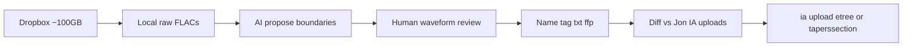

# Bluegrass DAT track-and-upload workflow

**Project root:** `/home/henry/dev/bluegrass-dat-tracker`  
**For agents:** Read this file first and execute it in order. Do not wait on community coordination before tracking. Validate against already-uploaded Archive.org shows before presenting new uploads.

## Overview

Download the full ~100GB Live Bluegrass Dropbox dump, build a human-in-the-loop AI tracking pipeline calibrated against Jon King’s already-uploaded Archive.org shows, then track and package every remaining show to etree/LMA standards for upload under Henry’s Archive.org account.

## Context already verified

- **Dropbox** ([Live Bluegrass](https://www.dropbox.com/scl/fo/lwcwu3y8qwktcdmcwt5b0/AFV4nzvqJ66AZ1vSMjs85vE?rlkey=62qci0un4hk40q9s0zu7r5gdg&dl=0)): ~**100 GB** zip (`content-length` ≈ 107 045 111 705 bytes); folders `Dave W Flacs`, `Brian H Flacs` (+ Wave 2/3), `Read Me_090726.txt`. Transfers are **untrimmed continuous FLACs with no track markers** (Cate Crowe: `DAT > Sony PCM-2600 > ESI U24XL > Audacity > FLAC`).
- **Read Me** (2026-09-07) invites help adding track numbers; contact `live.bluegrass.gal@gmail.com` or Reddit u/EngineerFickle4625. Dave: 143 tapes / ~130 transferred (working on remaining); Brian: 55/55 transferred.
- **Already on Archive.org** (ground truth): [Dave Ward Collection](https://archive.org/search?query=subject%3A%22Dave+Ward+Collection%22) (5) + [Brian H Collection](https://archive.org/search?query=subject%3A%22Brian+H+Collection%22) (10) ≈ **15 items / ~8 GB** tracked FLACs. Tracker/uploader: **Jon King** (`jking1620@gmail.com`); transferer: **Cate Crowe**.
- **Reddit update thread:** https://www.reddit.com/r/Bluegrass/comments/1w9yetu/update_on_dats_14_shows_uploaded_to_internet/

### Tracking conventions to match exactly

- Filenames: `{abbrev}{yyyy-mm-dd}_t01.flac` or `_s1t01` / `_s2t01` for multi-set (no spaces).
- Banter / tuning / intros / encore breaks are **their own tracks**, not deleted.
- Segues marked `>` in titles/setlist.
- Bundle: show `.txt` + `fingerprint.ffp.txt` (xACT-style FFP) + FLAC tags.
- IA: band **etree** collection when it exists, else **`taperssection`**; subject tags include `Dave Ward Collection` / `Brian H Collection`; credit transferer + tracker in description/txt.

### Example ground-truth identifiers

Dave: `jcb2002-08-02`, `prtr2002-08-02`, `docwatson2000-07-22.sbd`, `jcb2000-04-01`, `hotrize1996-06-09`  
Brian: `del2005-05-29`, `ocms2005-05-29`, `lf2005-05-28`, `rre2005-05-27`, `crookedstill2005-05-26`, `rre2004-09-02`, `ymsb2003-04-18.SBD`, `ymsb2003-04-18.Matrix`, `jmp2002-11-15`, `sci2002-04-06`

### Sample show.txt shape (from `jcb2002-08-02`)

```
John Cowan Band
August 2, 2002 (2002-08-02)
Riverbend Music Center
Cincinnati, OH

Source: SBD > DAT
Transfer: DAT > Sony PCM-2600>ESI U24XL > Audacity > FLAC
Transferred by: Cate Crowe
Tracked & Uploaded by: Jon King

One Set:
1. My Heart Will Follow You >
...
```

New uploads should keep Cate Crowe as transferer and credit the actual tracker/uploader (Henry / account used).



## Decisions locked in

- Project lives at **`/home/henry/dev/bluegrass-dat-tracker`** (this repo).
- Download **entire** Dropbox dump (~100 GB; host has ample free space).
- Track **all** shows; do **not** wait on coordination first.
- Treat Jon’s uploads as **calibration targets**: if our splits/names/metadata match those shows, proceed to package the rest for Henry’s Archive.org account.
- Use **semantic versioning** and a **Keep a Changelog** changelog; commit messages and changelog entries in the imperative.

## Directory layout

- `data/raw/` — Dropbox dump
- `data/ground_truth/` — downloaded Jon IA items (audio + txt + ffp)
- `data/work/` — per-show working dirs
- `data/out/` — finished etree-style packages ready to upload
- `catalog/` — inventory CSV/JSON (path, artist, date, venue, collection, status, IA id if any)
- `src/` — pipeline code
- `docs/` — extra notes, upload checklists
- `PLAN.md` — this file
- `CHANGELOG.md`, `pyproject.toml` (or equivalent) — add in Phase 0 scaffold

## Phase 0 — Project skeleton

1. Add `pyproject.toml` (or similar), `CHANGELOG.md`, version `0.1.0`.
2. Add `.gitignore` covering `data/raw/`, `data/work/`, large media, venvs.
3. Define catalog schema under `catalog/`.
4. Keep this `PLAN.md` as the source of truth for remaining work.

## Phase 1 — Ingest and inventory

1. Download full shared folder (Dropbox “Copy to Dropbox”, or resume-capable `curl`/`rclone` against the shared zip URL; expected size ≈ 107 045 111 705 bytes). Verify size after download.
2. Parse J-card photos + folder/file names into a **catalog** of candidate shows.
3. Cross-reference catalog against IA (`subject:"Dave Ward Collection"` / `Brian H Collection` and artist+date) → mark rows `already_uploaded` vs `todo`.
4. Download all already-uploaded items into `data/ground_truth/` (FLACs + `.txt` + `fingerprint.ffp.txt`) for offline comparison.

## Phase 2 — AI-assisted tracking (human-in-the-loop)

**Goal:** Propose split points; a human confirms on a waveform. Fully automatic release is not the bar — matching Jon’s style is.

Pipeline per raw full-show FLAC:

1. **Decode once** to a working WAV/PCM cache (or stream via ffmpeg) for analysis.
2. **Boundary proposal** (ensemble, not silence-only):
   - Energy / onset envelope + silence gaps (pydub/librosa/ffmpeg `silencedetect`).
   - Music vs non-music classifier (e.g. YAMNet-style approach as in [XTRACK](https://github.com/FlorianColombo/xtrack)) for applause / speech / music — critical because bluegrass often has **short** gaps and **long banter** that must stay as tracks.
   - Optional: chroma/novelty for song-to-song changes when applause is continuous.
3. **Review UI** (minimal, local): waveform + proposed cut markers; nudge/merge/split; label track type (song / banter / tuning / intro / encore break); mark segues.
4. **Export cuts** losslessly (`flac`/`sox`/`ffmpeg` sample-accurate) into etree filenames.
5. **Setlist assist**: optional ASR on banter + music fingerprint / LLM title guess from snippets — always human-editable; ground-truth shows teach expected title style.
6. Emit **show.txt** (Jon’s template: artist, date, venue, source, transfer, “Tracked & Uploaded by: …”, setlist, notes about Dave/Brian collections) + **fingerprint.ffp.txt** + Vorbis tags on each FLAC.

Calibration loop on the ~15 ground-truth shows:

- Run proposal → compare cut times to Jon’s track boundaries (align via cross-correlation / duration matching).
- Metrics: boundary F1 within ±N ms, track-count match, title similarity.
- Tune thresholds / post-rules (e.g. keep short speech islands as Banter; don’t merge across clear applause) until agreement is strong on a held-out subset of those shows.
- Only then batch-process the rest with the same review discipline.

## Phase 3 — Package and upload standards

For each finished show:

- Identifier / dir: etree style (`del2005-05-29`, `hotrize1996-06-09`, source suffix if needed e.g. `.sbd`).
- Choose collection: existing LMA band collection if present and band policy allows; otherwise `taperssection` (as Jon did for Hot Rize, Doc Watson, OCMS, etc.).
- Metadata fields: title, creator, date, venue, coverage, source, lineage, taper, transferer, subject tags including collection name.
- Upload via Archive.org account (`ia` CLI or web LMA uploader). Credit chain must remain honest: Cate Crowe transfer; Henry (or named account) as tracker/uploader; note source collection.

Do **not** re-upload the calibration shows as competing items if they already exist; use them only for validation. New uploads are for catalog rows still missing from IA (and any clearly distinct sources, e.g. SBD vs Matrix already separated).

## Phase 4 — Present results

Once ground-truth match is solid and a first batch of new shows is packaged:

- Draft (for Henry to post) a Reddit reply / email to OP summarizing method, validation against Jon’s uploads, and links to new IA items — offer the workflow/tooling if useful.
- Keep a checklist in the catalog of done vs remaining.

## Suggested implementation order

1. Scaffold project + changelog/version (Phase 0).
2. Start full Dropbox download; while it runs, pull ground-truth IA items + write catalog schema and Jon-template txt generator.
3. Build boundary proposer + offline diff against one known show (e.g. `jcb2002-08-02`).
4. Add review UI; calibrate on all ground-truth shows.
5. Process remaining shows in waves; upload when packages pass checklist.

## Risks / notes

- **100 GB** download may take hours; use resume-capable tooling.
- Some bands lack LMA permission → `taperssection` path is intentional, not a failure.
- Live bluegrass banter density means silence-only splitters will fail calibration; classifier + human review is required.
- Disk: `/home/henry` volume had ~380 GB free when this project was created (verify again before download).

## Todo checklist

- [x] Phase 0: scaffold (semver, changelog, catalog schema)
- [ ] Download full ~100GB Dropbox dump into `data/raw/` with resume
- [ ] Download all Dave Ward / Brian H IA items; mark catalog `already_uploaded` vs `todo`
- [ ] Implement ensemble boundary proposer + compare cuts to Jon ground-truth FLACs
- [ ] Build local waveform review UI for nudge/merge/split/label + segue marks
- [ ] Export etree-named FLACs, Jon-style txt, ffp, tags; calibrate until ground-truth match
- [ ] Track remaining shows; upload new items via `ia` CLI to etree or taperssection with correct credits
