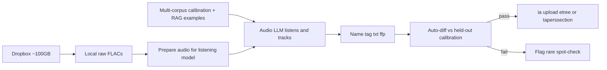

# DAT track-and-upload workflow

**Project / package name:** `dat-tracker` (Python import package: `dat_tracker`)  
**For agents:** Read this file first and execute it in order. Do not wait on community coordination before tracking. Validate against already-uploaded Archive.org shows before presenting new uploads.

## Overview

Download the full ~100GB Live Bluegrass Dropbox dump, build an **LLM-powered automatic tracking pipeline**, then track and package every remaining show to etree/LMA standards for upload under the operator’s Archive.org account.

**Calibration must not overfit Live Bluegrass alone (locked).** Jon King’s already-uploaded Dave Ward / Brian H items are the *primary* in-domain targets (same transfer chain and style), but the tracker must also be measured against **additional high-quality tracked DAT packages** from the same community and from other careful etree/LMA work—so prompts, tools, and thresholds generalize. Prefer small downloadable items. Longer term, treat a **large corpus of already-tracked DAT→FLAC packages on Archive.org** as training/RAG material so the LLM improves at the same job humans already did well.

**Quality bar (locked):** packages for new shows must match the style and accuracy of the calibration sets closely enough that **human waveform review is not part of the happy path**. Prefer **no human intervention**; allow only **extremely minimal** review when automated confidence or calibration metrics fail a show (flag for optional spot-check, do not require a waveform UI workflow).

**Second goal (locked):** once this Live Bluegrass run is calibrated and we can present finished tracked packages with confidence, **package the application and workflow** so others can apply the same method to **other DAT dumps** (different tapers, transfers, collections). Live Bluegrass is the proving ground and first product; the reusable tool is an explicit deliverable, not an afterthought.

## Context already verified

- **Dropbox** ([Live Bluegrass](https://www.dropbox.com/scl/fo/lwcwu3y8qwktcdmcwt5b0/AFV4nzvqJ66AZ1vSMjs85vE?rlkey=62qci0un4hk40q9s0zu7r5gdg&dl=0)): ~**100 GB** zip (`content-length` ≈ 107 045 111 705 bytes); folders `Dave W Flacs`, `Brian H Flacs` (+ Wave 2/3), `Read Me_090726.txt`. Transfers are **untrimmed continuous FLACs with no track markers** (Cate Crowe: `DAT > Sony PCM-2600 > ESI U24XL > Audacity > FLAC`).
- **Read Me** (2026-09-07) invites help adding track numbers; contact `live.bluegrass.gal@gmail.com` or Reddit u/EngineerFickle4625. Dave: 143 tapes / ~130 transferred (working on remaining); Brian: 55/55 transferred.
- **Already on Archive.org** (ground truth): [Dave Ward Collection](https://archive.org/search?query=subject%3A%22Dave+Ward+Collection%22) (5) + [Brian H Collection](https://archive.org/search?query=subject%3A%22Brian+H+Collection%22) (10) ≈ **15 items / ~8 GB** tracked FLACs. Tracker/uploader: **Jon King** (`jking1620@gmail.com`); transferer: **Cate Crowe**.
- **Reddit update thread:** https://www.reddit.com/r/Bluegrass/comments/1w9yetu/update_on_dats_14_shows_uploaded_to_internet/

### Tracking conventions to match exactly

- Filenames: `{abbrev}{yyyy-mm-dd}_t01.flac` or `_s1t01` / `_s2t01` for multi-set (no spaces).
- Banter / tuning / intros / encore breaks are **their own tracks**, not deleted.
- Segues marked `>` in titles/setlist.
- Bundle: show `.txt` + `fingerprint.ffp.txt` (xACT-style FFP) + FLAC tags.
- IA: band **etree** collection when it exists, else **`taperssection`**; subject tags include `Dave Ward Collection` / `Brian H Collection`; credit transferer + tracker in description/txt.

### Example ground-truth identifiers

Dave: `jcb2002-08-02`, `prtr2002-08-02`, `docwatson2000-07-22.sbd`, `jcb2000-04-01`, `hotrize1996-06-09`  
Brian: `del2005-05-29`, `ocms2005-05-29`, `lf2005-05-28`, `rre2005-05-27`, `crookedstill2005-05-26`, `rre2004-09-02`, `ymsb2003-04-18.SBD`, `ymsb2003-04-18.Matrix`, `jmp2002-11-15`, `sci2002-04-06`

### Sample show.txt shape (from `jcb2002-08-02`)

```
John Cowan Band
August 2, 2002 (2002-08-02)
Riverbend Music Center
Cincinnati, OH

Source: SBD > DAT
Transfer: DAT > Sony PCM-2600>ESI U24XL > Audacity > FLAC
Transferred by: Cate Crowe
Tracked & Uploaded by: Jon King

One Set:
1. My Heart Will Follow You >
...
```

New uploads should keep Cate Crowe as transferer and credit the actual tracker/uploader (the Archive.org account used for upload).



## Decisions locked in

- Package name is **`dat-tracker`** (import package `dat_tracker`).
- Download **entire** Dropbox dump (~100 GB; ensure the host has enough free disk).
- Track **all** shows; do **not** wait on coordination first.
- Treat Jon’s Dave Ward / Brian H uploads as **primary in-domain calibration**, but **do not** tune solely against them—require held-out metrics on **additional external tracked DAT packages** so the system does not overfit one dump’s quirks (tape gaps, festival multi-artist files, naming).
- **Automation first (locked):** the LLM drives boundary placement, track-type labels, segue marks, titles/setlist. Packaging/upload requires an explicit human **review gate** via the cross-platform Textual TUI (`dat-review`), with a one-key **Accept-all** fast path when the auto plan looks good. This is not a DAW and not optional silent packaging; `--force-unreviewed` is an escape hatch only. Weak calibration metrics remain a pipeline bug to fix, not a reason to skip review forever.
- **LLM-in-the-loop listens (locked):** the tracker role is what a careful human does today in Audacity/xACT — *hear* transitions and decide cuts/labels/titles — not a text-only model that only reads a pre-digested feature dump. Prefer an **audio-native** LLM (primary: **Google Gemini**). Text-only chat models (e.g. Claude without audio) are out of scope for the tracker decision step.
- **Sparse listening for cost (locked):** do **not** send the full show to the LLM by default. Classical/ASR proposals find *where to scrub*; the model listens only to **short clips around candidate boundaries** (and rare low-confidence follow-ups). Prefer cheaper Gemini Flash for iteration; escalate to Pro only when Flash fails held-out gates. Full-show audio upload is an exceptional fallback, not the happy path.
- **Corpus-driven improvement (locked):** build toward using many already-tracked Archive.org DAT shows as (1) few-shot / RAG style examples, (2) synthetic re-split benchmarks (concatenate published tracks → recover cuts), and later (3) optional fine-tuning / preference data—not only the 15 Live Bluegrass items.
- Use **semantic versioning** and a **Keep a Changelog** changelog; commit messages and changelog entries in the imperative.
- **Reusable product:** design the pipeline so Live Bluegrass-specific facts (Dropbox URL, Dave/Brian collection tags, Cate/Jon credit defaults, this dump’s folder layout) live in **config / catalog data**, not hard-wired into core tracking, packaging, or upload code. After a successful first batch, ship installable tooling + docs so another operator can point it at a different untrimmed DAT→FLAC dump and get the same automatic, calibration-gated flow.

## Directory layout

- `data/raw/` — Dropbox dump
- `data/ground_truth/` — primary Live Bluegrass Jon IA items (audio + txt + ffp)
- `data/calibration/` — external / held-out tracked packages + synthetic re-split work (keep small; gitignored media)
- `data/work/` — per-show working dirs
- `data/out/` — finished etree-style packages ready to upload
- `catalog/` — inventory CSV/JSON (path, artist, date, venue, collection, status, IA id if any)
- `src/` — pipeline code
- `docs/` — extra notes, upload checklists, calibration corpus notes
- `PLAN.md` — this file
- `CHANGELOG.md`, `pyproject.toml` (or equivalent) — add in Phase 0 scaffold

## Phase 0 — Project skeleton

1. Add `pyproject.toml` (or similar), `CHANGELOG.md`, version `0.1.0`.
2. Add `.gitignore` covering `data/raw/`, `data/work/`, large media, venvs.
3. Define catalog schema under `catalog/`.
4. Keep this `PLAN.md` as the source of truth for remaining work.

## Phase 1 — Ingest and inventory

1. Download full shared folder (Dropbox “Copy to Dropbox”, or resume-capable `curl`/`rclone` against the shared zip URL; expected size ≈ 107 045 111 705 bytes). Verify size after download.
2. Parse J-card photos + folder/file names into a **catalog** of candidate shows.
3. Cross-reference catalog against IA (`subject:"Dave Ward Collection"` / `Brian H Collection` and artist+date) → mark rows `already_uploaded` vs `todo`.
4. Download all already-uploaded items into `data/ground_truth/` (FLACs + `.txt` + `fingerprint.ffp.txt`) for offline comparison.

## Phase 2 — LLM-powered automatic tracking

**Goal:** End-to-end automatic tracking that **matches high-quality etree-style packages** (boundaries, track count/types, titles, txt/ffp/tags) well enough to ship without human waveform review. Silence detection alone is insufficient; the LLM must reason over rich audio-derived evidence. Primary in-domain targets are Jon’s Live Bluegrass packages; **shipping gate also requires solid held-out scores on an external calibration slice**.

### How we achieve this (modern stack)

Automated live-show tracking is **LLM-as-tracker** (listen → decide → package), not “run silence detect then hope.” Classical/ASR features may assist, but the model that places cuts must **hear the audio** the way a human tracker does.

1. **LLM-in-the-loop (core, sparse audio)**  
   Classical/ASR proposals mark candidate cut times (like a human scanning the waveform overview). An audio-native model (**Gemini**, default **Flash**) listens to **short windows around those candidates** (and optional mid-gap probes when a span is too long for one song), then emits a structured tracking plan: accept/reject/snap cuts, track types, segues, titles, confidence. Same judgment as scrubbing transitions in a DAW — without uploading the whole tape on every call.

2. **Optional perception aids (not a substitute for listening)**  
   Energy/silence/novelty, music vs speech vs applause classifiers, Whisper banter islands, fingerprint title hints. Useful as prompt hints, candidate shortlists, or snap/refine after the LLM proposes cuts — never as the only sensory channel for a text-only LLM.

3. **Learn from the archive (why Tier B/C exist)**  
   Thousands of already-tracked DAT packages on IA are labeled cut lists in disguise. Synthetic re-split + show.txt corpora let us (a) eval without overfitting Live Bluegrass, (b) RAG style/setlist patterns, (c) later train a specialist boundary head or preference-tune the decision policy. Full fine-tunes are Phase 2b — not a blocker for a first shippable Live Bluegrass batch once held-out metrics pass.

4. **Hard cases we design for**  
   - Short gaps / long banter (bluegrass).  
   - Multi-artist continuous files (e.g. Riverbend `020802_JCB_RR` ≈ JCB + PRTR).  
   - Jon packages that are **not** bit-identical excerpts of our raw (alignment by content, not PCM equality).

Pipeline per raw full-show FLAC:

1. **Prepare listening clips** from the master (ffmpeg extract short windows around candidate times; keep cut times on the lossless timeline).
2. **Propose candidates** cheaply: energy / silence / ASR islands → where the LLM should scrub.
3. **LLM tracking decision** — model **listens to clips** (not the whole show by default) and:
   - Accepts, rejects, or snaps each candidate cut.
   - Labels each resulting track (song / banter / tuning / intro / encore break).
   - Marks segues (`>`).
   - Proposes titles and setlist structure in Jon’s / etree style, using what it hears plus folder/J-card context and **few-shot examples from the multi-corpus calibration set**.
   - Emits a structured tracking plan (JSON) with per-boundary confidence; may request extra clips only for low-confidence regions.
4. **Export cuts** losslessly (`flac`/`sox`/`ffmpeg` sample-accurate) into etree filenames from the LLM plan after the review gate (Accept-all or edited approve).
5. Emit **show.txt** (Jon’s template: artist, date, venue, source, transfer, “Tracked & Uploaded by: …”, setlist, notes about Dave/Brian collections) + **fingerprint.ffp.txt** + Vorbis tags on each FLAC.
6. **Review gate (required):** open `dat-review` on the tracking plan (waveform + cut/label/metadata editor, or `--accept-all`). Packaging refuses `review.status != approved` unless `--force-unreviewed`.

### Calibration tiers (anti-overfit)

| Tier | What | Role |
|------|------|------|
| **A — In-domain pairs** | Live Bluegrass raw continuous FLACs + Jon’s 15 IA packages (Cate Crowe transfer / Jon King track) | Primary: true raw→tracked evaluation; same lineage as production |
| **B — Style siblings** | Other careful bluegrass/jam **DAT→FLAC** etree/taperssection packages (prefer small &lt;~500–700 MB; same community conventions: banter as tracks, `>`, ffp, info txt). Include more Jon-tracked items when useful, but also **other trackers** so we do not memorize one person’s quirks | Held-out packaging + synthetic re-split |
| **C — Broad corpus** | Larger archive of already-tracked DAT shows (metadata + txt + optional audio) for RAG / later fine-tuning | Scale: teach general tracking judgment |

**Synthetic re-split (Tier B/C when no raw dump exists):** losslessly concatenate published track FLACs into one continuous file, hide the cut list, run the tracker, score recovered boundaries against the known cuts. This is slightly easier than real untrimmed tape (joins are cleaner), but it is the practical way to get **many** labeled examples without original continuous masters. Prefer Tier A whenever raw+tracked pairs exist.

Calibration loop:

- Split Tier A and Tier B into **train/few-shot** vs **held-out** (never tune thresholds only on the show you are scoring).
- Metrics: boundary F1 within ±N seconds, track-count match, title similarity, set/structure agreement, show.txt field completeness.
- **Numeric shipping gate (locked):** before batching Live Bluegrass `todo` shows:
  - **Tier B held-out** (synthetic re-split): mean boundary F1 ≥ **0.85** at ±15 s, and no held-out show below **0.70**.
  - **Tier A held-out** (real raw ↔ Jon package): mean boundary F1 ≥ **0.80** at ±15 s on at least three shows (include at least one multi-artist night once alignment works).
  - Track-count: \|hypothesis − reference\| ≤ 1 on at least 80% of those held-out shows.
  - Titles may lag boundaries for v1; do not block the boundary gate on title similarity, but flag weak titles in `needs_review` notes.
- Only then batch-process remaining shows; auto-accept packages that pass the same confidence/checklist gates.

### Phase 2a — External calibration corpus (do early, in parallel)

1. Curate a shortlist of **small** IA items (target roughly a handful to a few dozen shows, disk budget on the order of tens of GB, not another 100 GB): bluegrass/adjacent, DAT lineage, complete FLAC+txt(+ffp) packages, reputable tracking.
2. Prefer: same transfer/tracker community when available; otherwise other meticulous etree DAT SBDs with clear info files. Avoid using Live Bluegrass held-out shows as the *only* external set.
3. Download into `data/calibration/` with a manifest (identifier, size, why included, tier, train vs holdout).
4. Build synthetic continuous FLACs + known cut lists for re-split benchmarks.
5. Wire the same auto-diff metrics used for Tier A.

Verified so far: Cate Crowe + Jon King on IA currently appear to be **exactly the 15** Dave Ward / Brian H items (~10 GB)—so external diversity **must** come from other trackers/collections, not more Cate/Jon bluegrass. Jon’s other uploads are mostly modern AUD/CM4 tapers (different problem). Candidate seed queries: etree/taperssection + bluegrass/adjacent + `DAT` lineage + Flac + item size capped (e.g. 80–450 MB), e.g. small Del McCoury / Sam Bush / Leftover Salmon / YMSB DAT packages—curate manually for info-file quality before bulk download.

### Phase 2b — Scale toward “train the tracker” (after 2/2a work)

Do not block Live Bluegrass shipping on full fine-tunes, but design data collection so we can:

1. Index many show.txt + tracklists + (optional) boundary times from IA DAT packages as **RAG / few-shot memory**.
2. Grow synthetic re-split datasets for offline eval and, later, supervised or preference training of a specialist model.
3. Keep Live Bluegrass production config separate from the generic trained policy.

## Phase 3 — Package and upload standards

**Deferred implementation plan (in-TUI package → confirm → Archive.org upload):** see [`docs/plans/in-tui-package-and-archive-upload.md`](docs/plans/in-tui-package-and-archive-upload.md) (implemented; operator checklist in [`docs/upload-checklist.md`](docs/upload-checklist.md)).

For each finished show:

- Identifier / dir: etree style (`del2005-05-29`, `hotrize1996-06-09`, source suffix if needed e.g. `.sbd`).
- Choose collection: existing LMA band collection if present and band policy allows; otherwise `taperssection` (as Jon did for Hot Rize, Doc Watson, OCMS, etc.).
- Metadata fields: title, creator, date, venue, coverage, source, lineage, taper, transferer, subject tags including collection name.
- Upload via Archive.org account (`ia` CLI or web LMA uploader). Credit chain must remain honest: Cate Crowe transfer; the uploading account as tracker/uploader; note source collection.

Do **not** re-upload the calibration shows as competing items if they already exist; use them only for validation. New uploads are for catalog rows still missing from IA (and any clearly distinct sources, e.g. SBD vs Matrix already separated).

## Phase 4 — Present results

Once ground-truth match is solid and a first batch of new shows is packaged:

- Draft a Reddit reply / email to OP summarizing method, validation against Jon’s uploads, and links to new IA items — **offer the reusable workflow/tooling**, not only the finished IA items. Leave community posting to the maintainer.
- Keep a checklist in the catalog of done vs remaining (including any rare `needs_review` leftovers).

## Phase 5 — Package for other DAT dumps

Do this **after** Phases 2–4 prove the method on Live Bluegrass (do not block tracking on packaging polish).

1. Extract a clear **operator-facing entrypoint** (CLI): ingest raw continuous FLACs → LLM tracking → export etree package (FLACs + show.txt + ffp + tags) → optional IA upload helpers; optional `needs_review` report for failures.
2. Document a **project/config model** for a new dump: paths, collection/subject tags, default transferer/tracker credits, source/lineage strings, optional ground-truth IA queries for calibration when analogs exist, LLM/provider settings.
3. Keep dump-specific inventory in `catalog/` (or equivalent); keep algorithms and LLM tooling generic under `src/`.
4. Publish install/run docs (venv/`pip install`, ffmpeg/sox deps, disk expectations, resume downloads, API keys for LLM/ASR) so someone with another DAT transfer set can reproduce the workflow without reading this PLAN end-to-end.
5. When presenting to the Bluegrass community, point at both the new IA uploads **and** the packaged tool.

## Suggested implementation order

1. Scaffold project + changelog/version (Phase 0).
2. Start full Dropbox download; while it runs, pull ground-truth IA items + write catalog schema and Jon-template txt generator.
3. Build signal extractors + offline auto-diff against one known show (e.g. `jcb2002-08-02`); account for multi-artist night tapes in one raw FLAC.
4. **In parallel:** curate + download a small Tier B external calibration set; add synthetic re-split harness.
5. Wire LLM decision loop (boundaries, labels, titles) with few-shot/RAG from the multi-corpus set; iterate until held-out Tier A **and** Tier B metrics pass.
6. Batch remaining Live Bluegrass shows with confidence gates; upload when packages pass checklist (spot-check only failures).
7. Grow Tier C indexing / optional fine-tune data (Phase 2b) without blocking uploads.
8. Package CLI/docs/config for reuse on other DAT dumps (Phase 5); mention it in the community write-up.

## Risks / notes

- **100 GB** download may take hours; use resume-capable tooling.
- Some bands lack LMA permission → `taperssection` path is intentional, not a failure.
- Live bluegrass banter density means silence-only splitters will fail calibration; **LLM + classifier/ASR evidence** is required — not a human review crutch.
- Achieving Jon-level agreement with zero intervention is hard; treat weak metrics as a pipeline bug to fix, not as a reason to add a waveform UI.
- **Overfitting:** tuning only on the 15 Jon packages (or one night like `020802_JCB_RR`) will look good and fail elsewhere—external Tier B held-out is mandatory.
- **Raw+tracked pairs are rare**; Cate/Jon bluegrass on IA is currently just those 15 items. Synthetic re-split is necessary for scale; always re-check on true Tier A raws before shipping.
- Some raw dump files contain **multiple artists/sets** (e.g. Riverbend 2002-08-02 PRTR + JCB in one FLAC)—alignment/segmentation is part of tracking, not a catalog error.
- Disk: verify free space before the ~100 GB dump download; keep external calibration downloads size-capped.
- Reuse packaging too early risks baking in Live Bluegrass assumptions; prefer proving calibration first, then extracting config (Phase 5). While building Phases 1–3, still **avoid hardcoding** collection names and credit strings in core modules when a config/parameter will do.
- LLM/ASR cost and latency will matter at full-dump scale; cache features and avoid re-decoding.

## Todo checklist

- [x] Phase 0: scaffold (semver, changelog, catalog schema)
- [x] Download full ~100GB Dropbox dump into `data/raw/` with resume
- [x] Download all Dave Ward / Brian H IA items; mark catalog `already_uploaded` vs `todo`
- [x] Build catalog from zip listing + IA (YYMMDD dump names); link calibration raw paths
- [x] Curate + download small Tier B external calibration set; synthetic re-split harness
- [x] Classical/ASR proposal stack + boundary F1 scoring (Tier B train/holdout; Tier A align extracts)
- [x] Sparse Gemini listen / refine / optional gap-fill / Pro escalate → tracking-plan JSON + package export
- [ ] Raise held-out Tier A **and** Tier B metrics to the locked shipping gates (still failing; see README Status)
- [ ] Few-shot / RAG from multi-corpus calibration; harden titles/segues beyond boundary F1
- [ ] Fix festival multi-artist Tier A alignment; guard Pro escalate against track-count collapse
- [ ] Batch remaining Live Bluegrass `todo` shows only after gates pass; upload via `ia` with correct credits
- [ ] Phase 2b: index broader DAT tracked corpus for RAG / future training
- [ ] Phase 5: package installable automatic workflow + docs so others can run it on other DAT dumps
