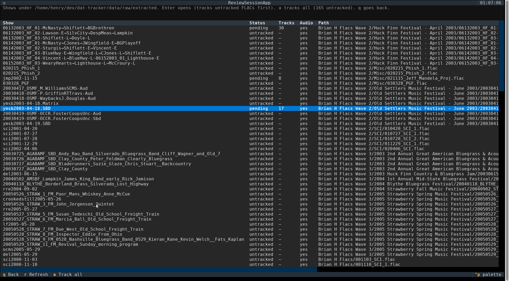
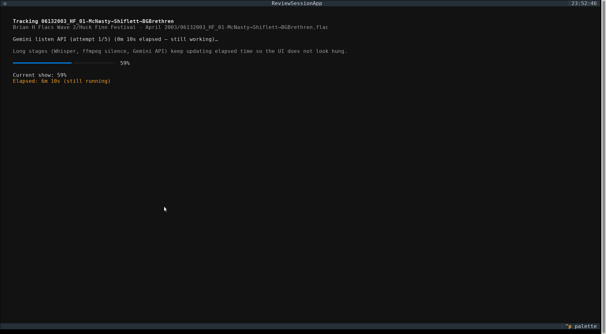
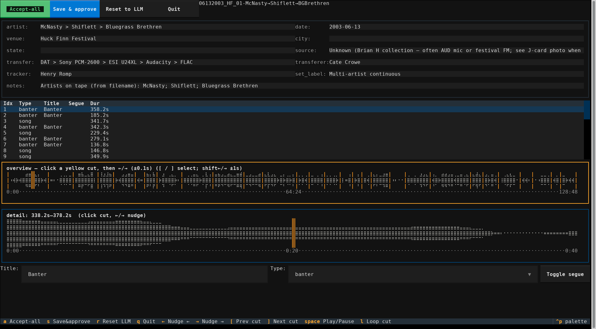
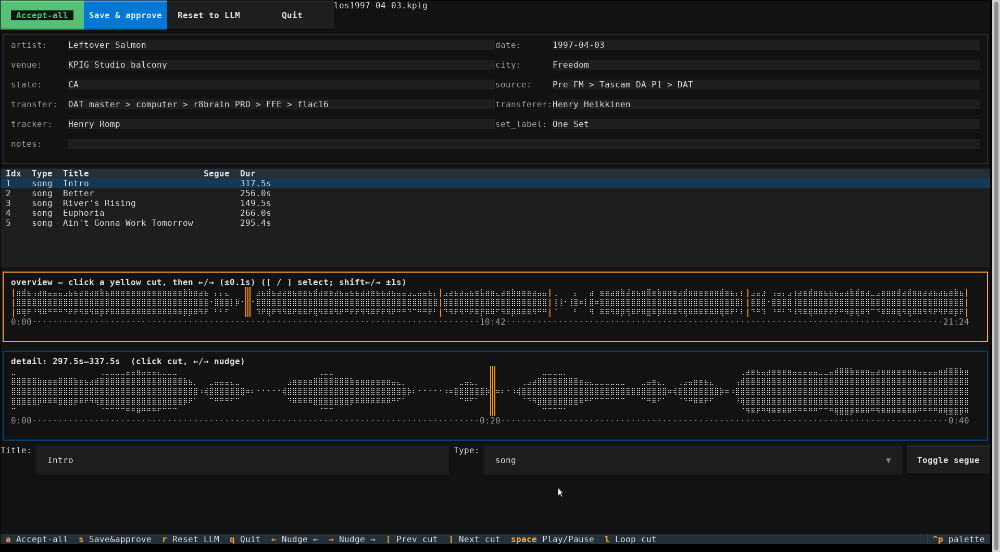

# dat-tracker

**dat-tracker** helps turn a long, continuous live recording (often one big FLAC from a DAT tape) into a finished show package: separate song tracks, an info text file, fingerprints, and tags — ready for Archive.org / etree-style sharing.

The everyday tool is **`dat-review`**: a terminal app that walks you from “here is my folder of FLACs” through automatic tracking, a review screen, packaging, and (if you want) Archive.org upload.

**Status:** early (**0.1.1**). It is usable for trying the flow on your own continuous FLACs. Batch-uploading a whole dump is **not** recommended yet — tracking quality is still being calibrated (see [PLAN.md](PLAN.md)).

---

## Try it out (recommended)

You do **not** need to install Python or clone this repository to try the app. Use a release binary, get a free **Gemini API key**, then run `dat-review`. (Release builds ship with ffmpeg tools bundled.)

### 1. Download `dat-review`

1. Open **[Releases](https://github.com/151henry151/dat-tracker/releases)**.
2. Download the binary for your computer:
   - **Linux:** `dat-review-linux-x86_64`
   - **Windows:** `dat-review-windows-x86_64.exe`
   - **macOS (Apple Silicon):** `dat-review-macos-arm64`
3. Put it somewhere convenient (Desktop, Downloads, or a tools folder).

**Linux / macOS:** make it executable once, then run it from a terminal:

```bash
chmod +x dat-review-linux-x86_64   # or dat-review-macos-arm64
./dat-review-linux-x86_64
```

**Windows:** double-click the `.exe`, or run it from PowerShell / Command Prompt in the folder where you saved it:

```powershell
.\dat-review-windows-x86_64.exe
```

If a binary for your OS is missing from the latest release, use [Install from source](#install-from-source-developers) below, or check back on the Releases page.

### 2. Get a Gemini API key (free to create)

Tracking listens to short audio clips with Google’s **Gemini** API.

1. Open **[Google AI Studio → API keys](https://aistudio.google.com/apikey)** and sign in with a Google account.
2. Create an API key and copy it (treat it like a password).

On first launch, `dat-review` can ask you to paste the key and save it for next time. You can also put it in a `.env` file next to the binary or in the project folder (see [Gemini API key details](#gemini-api-key-details)).

A Free Tier key is enough to try the app. Long shows use several API requests; free daily limits are low — for many shows per day you may need billing in AI Studio. [Billing](https://ai.google.dev/gemini-api/docs/billing) · [pricing](https://ai.google.dev/gemini-api/docs/pricing).

### 3. Run it on your FLACs

1. Start `dat-review` (see step 1).
2. If asked, enter your **tracker name** (how you want to be credited) and paste your **Gemini API key**.
3. Browse to the folder that contains your continuous show FLACs (not a zip — an unzipped folder of `.flac` files).
4. Pick a show from the list:
   - **Enter** on one show → track it (if needed) → open the review screen.
   - **`a`** → **Track all** untracked shows (can take a long time and use API quota).
5. On the review screen, check cuts and titles. When it looks good:
   - **`a`** Accept-all, or **`s`** Save & approve.
6. The app continues into **packaging**, then asks whether to **upload to Archive.org** (you can skip and keep the local package).

Finished packages land under `data/out/<show-id>/` when you run from a project checkout; with a standalone binary, paths follow the working directory you launched from (and any project root you pass with `--root`).

**Tips**

- First track of a long FLAC can take **many minutes** on CPU (speech transcription). The screen shows live progress and elapsed time so it does not look hung.
- When a dump show has no companion `.txt`, package fields still seed from the FLAC filename and folder names (date, artists, festival), Dave W / Brian H collection defaults, and — when a sibling J-card photo is present — Gemini vision of that image.
- You still need **disk space** for work files and exported tracks.
- Press **`q`** in review to return to the show list (you do not have to quit the whole app).

### Common keyboard shortcuts (review screen)

| Key | Action |
|-----|--------|
| Click yellow cut / `[` `]` | Select previous / next cut |
| `←` `→` | Nudge cut (Shift = larger step) |
| Space | Play / pause from the playhead |
| `l` | Loop around the selected cut |
| `a` | Accept-all |
| `s` | Save & approve |
| `r` | Reset cuts/titles to the automatic plan (keeps package fields) |
| `q` | Back to show list / quit as prompted |

---

## Screenshots

**Dump show list** — continuous FLACs under a folder, with tracked vs untracked status:



**Live tracking progress** — Whisper / ffmpeg / Gemini stages keep updating so long runs do not look hung:



**Review** — package metadata, track list, full-show overview and zoomed cut detail:



**Review with full package fields** — artist, venue, source/transfer, and setlist ready to Accept-all:



---

## What you get

For each show the tool aims to produce:

- Separate **FLAC tracks** with sensible filenames
- A **show.txt**-style info file (artist, date, venue, source/transfer, setlist)
- A **fingerprint** file and tags on the audio
- Optional **Archive.org** upload after you confirm

Conventions match careful live tracking: banter/tuning/intros as their own tracks, segues marked with `>`, honest transfer/tracker credits.

---

## Gemini API key details

`dat-review` looks for `GEMINI_API_KEY` in the environment or in a `.env` file.

Example `.env`:

```text
GEMINI_API_KEY=your_key_here
DAT_TRACKER_LLM_MODEL=gemini-3.6-flash
```

| Question | Short answer |
|----------|----------------|
| Credit card required to try? | **No** — Free Tier works for a first try |
| Catch on Free Tier? | **Low rate limits** (easy to hit on a long show). Check **[AI Studio → Rate limits](https://aistudio.google.com/)** for your project. |
| Tokens free on Free Tier? | **Yes** for models that still list a Free Tier on the [pricing page](https://ai.google.dev/gemini-api/docs/pricing) (Flash-class defaults usually do) |
| When to enable billing? | When you hit `429` / quota errors, want several shows per day, or higher limits. Paid setup is from AI Studio (**Set up billing**). See [billing](https://ai.google.dev/gemini-api/docs/billing) and [rate limits](https://ai.google.dev/gemini-api/docs/rate-limits). |
| Web search for missing venue? | Needs a **paid** Gemini project; without it, companions/heuristic fill still run |

Never commit a real `.env` (it is gitignored in this repo).

---

## Optional: Archive.org login

After you approve a show, packaging can offer upload. Log in inside the TUI (same idea as `ia configure`), or configure the Archive.org CLI yourself if you installed from source. See [`docs/upload-checklist.md`](docs/upload-checklist.md). The app will not silently upload.

---

## Background (why this exists)

Live DAT → FLAC transfers often arrive as **one long file with no track markers**. Splitting them carefully by hand takes hours per show. Silence detectors and energy peak-pickers help a little on studio albums, but live soundboards keep applause and room tone in the mix — so automatic helpers usually leave you dragging markers in a waveform editor anyway.

### The problem

Live transfers often arrive as one long FLAC per tape or set. Turning that into a publishable show means placing every track boundary, naming songs, keeping banter and tuning as their own tracks, marking segues, writing the info file, fingerprints, and tags — then repeating it for the next dump. Done carefully by hand in a waveform editor, that is hours per show and does not scale when someone drops a hundred untrimmed DATs.

Helpers exist, but they rarely finish the job on live soundboard / audience tapes:

- **Silence detection** — `ffmpeg silencedetect`, SoX `silence`, [mp3splt](https://mp3splt.sourceforge.net/) (`-s` silence mode), Audacity “Silence Finder” / “Label Sounds”, pydub `split_on_silence`, and countless “album splitter” GUIs. These work best on studio albums and podcasts with real dead air. Live SBDs keep applause and room tone in the mix; thresholds that work in the studio find nothing on a gig tape, and thresholds that catch applause also fire inside songs or on quiet bridges.
- **Spectral / energy / onset shifts** — closer to the right idea for live material (instrumentation vs crowd, or a hard attack into the next tune). Examples: RMS/novelty peak pickers, [Audio File Splitter](https://github.com/luckymuck/Audio-File-Splitter), [aubio](https://aubio.org/) (`aubioonset` / `aubiocut`), and MIR libraries such as [madmom](https://github.com/CPJKU/madmom) (onset / beat / downbeat models). They propose *many* plausible events; most are mid-song accents, not etree track starts. You still end up dragging markers.
- **Music structure analysis (research MSA)** — academic systems that segment songs into verse/chorus/sections or detect “boundaries” in pop recordings. Useful vocabulary and features; not trained on etree conventions (banter as its own track, `>` segues, applause glued to the previous song, etc.), and rarely shipped as a “split this DAT for Archive.org” product.
- **Fingerprinting / recognition** — ACRCloud, AudD, Shazam-class APIs stamp known studio (or heavily circulated) recordings with timestamps. Fine for a setlist of radio hits; useless for unreleased jams, alternate arrangements, and material that is not in the database.
- **Cue / CDDB / metadata-driven splitters** — [mp3splt](https://mp3splt.sourceforge.net/) with `.cue` / CDDB / Freedb, Flacon, shntool + cue, FFcuesplitter, foobar2000 playing an embedded cue. These **apply** known cut times; they do not **discover** them. Great once a human (or another tool) already tracked the show.
- **Fixed-interval / equal-length chops** — mp3splt time mode, audiobook “split every N minutes” tools. Handy for rough navigation; wrong model for songs of uneven length.
- **Manual waveform / DAW workflows** — Audacity label tracks, Reaper regions, Sound Forge, Izotope RX, etc., often paired with exporters (labels → cue). This is still how most careful live tracking gets done; the cost is human time.

A realistic workflow with the automatic helpers on a two-hour set is: run detection, then spend a while fixing boundaries. Segues, quiet intros, and stage banter that runs into a count-in defeat a fully automatic silence pass.

(As an aside: search for “AI track splitting” and you mostly get **stem** splitters — Demucs, UVR, Spleeter, and friends — vocals/drums/bass separation. That is a different task from chronological track marking on a continuous live recording.)

**dat-tracker** is built for the labor gap: automate the *tracking and packaging* pipeline, calibrate against already-excellent human-tracked shows, and treat remaining misses as rare exceptions — not as “open a waveform UI for every show.”

### Why this approach (and not only classical DSP or a laptop LLM)

**Classical detectors stay in the loop as navigation aids** — silence ends, energy novelty, speech/banter islands from ASR — because they are cheap and local. Alone they do not match careful human packaging: the hard cases are “where does the *next track* start for etree?” (often on banter or a count-in), not “where did RMS spike?”

**An audio-capable LLM listens to short clips around those candidates** (Google Gemini by default) and emits a structured tracking plan: keep / drop / nudge cuts, track types, titles, segues. Sparse clips keep API cost low (cents per show on paid Flash-class models) while still putting a model *in* the decision loop rather than only post-processing a transcript.

**Why not a fully local audio LLM on a typical laptop?** Models that actually *listen* (e.g. open audio-language models in the Qwen2-Audio class) need substantial GPU memory — often on the order of **8–16 GB VRAM** for comfortable inference — and are usually happiest on short clips anyway. A common mobile workstation GPU with ~4 GB VRAM is not a realistic drop-in for that job. Stacks people confuse with “local LLM tracking” — Whisper ASR plus a text-only Ollama/Llama chat model — never hear the music; they only reason about transcripts, which is the brittle path this project deliberately avoids for boundary placement.

**Why not “just train an LLM on Archive.org” yet?** In principle track splitting is a learnable perception problem, and IA has a huge supply of already-tracked packages. The practical recipe is close to what our Tier B calibration already uses: concatenate published tracks into a continuous file, hide the cuts, score recovery (synthetic re-split). Obstacles to a shippable specialist model today:

- **Supervision is packaging policy, not physics** — different trackers disagree on banter-as-track, applause tails, and segue cuts; a model learns *someone’s* conventions unless you curate carefully and hold out by taper/artist.
- **Synthetic joins ≠ raw DAT** — lossless concatenation is cleaner than real untrimmed tape (dropouts, tune-ups, tape flips). Models can overfit join artifacts and then fail on true continuous masters (our Tier A).
- **“Train an LLM” is the expensive end of the spectrum** — fine-tuning a large multimodal audio model needs data plumbing, money, and often limited fine-tune APIs. A smaller boundary detector (or distillation from Gemini judgments) may be the right long-term path; it is Phase 2b / research scale, not a substitute for a working sparse-listen loop while we calibrate.
- **Cost of iteration** — during development, paid cloud audio is cheap per show relative to engineering time; free-tier request caps are the usual friction, not dollar cost at Flash rates.

So the current design is intentional: **cheap local proposals → sparse cloud listening → calibrate hard against held-out human packages**, with room later for RAG over many show.txt files and optional trained specialists — without blocking Live Bluegrass packaging on a full custom training stack.

### What it does

1. **Ingest** continuous FLACs (and catalog them against known Archive.org items when you have them).
2. **Propose boundaries** with an ensemble of signals — not silence alone: energy/novelty, silence gaps, speech/banter islands (ASR), and (planned) music vs applause classifiers.
3. **Decide** track cuts, types (song / banter / tuning / intro / …), segues, and titles via an audio-native LLM that listens to sparse clips around candidates (plus show context / few-shot from calibration packages).
4. **Export** lossless cuts into etree-style names, Jon/etree-style `show.txt`, fingerprint files, and tags.
5. **Validate** against held-out, already-tracked packages so the tool does not overfit one dump or one taper’s quirks.
6. **Reuse** the same flow on other DAT (or similar continuous) dumps via config — Live Bluegrass is the first proving ground, not the only intended use.

### What “good” means here

Matching careful human tracking conventions, for example:

- Banter, tuning, and intros are **tracks**, not deleted dead air.
- Segues marked with `>` in titles/setlists.
- Filenames like `artistabbrevYYYY-MM-DD_t01.flac` or `_s1t01` / `_s2t01`.
- Bundle: FLAC + info `.txt` + fingerprint (`.ffp` / `fingerprint.ffp.txt`) + tags.
- Honest credit chains for transferer / tracker on Archive.org uploads.

Fully automatic *proposal* is the goal; packaging still goes through a required review gate (`dat-review`) with a one-key **Accept-all** fast path when the plan looks good.

### Status detail

Early development (**0.1.1**). Version stays in the **0.1.x** line until Live Bluegrass packaging passes the locked calibration gates in [PLAN.md](PLAN.md). Do **not** treat the dump’s remaining `todo` FLACs as ready to batch yet — calibration quality is still below the bar.

#### Done

- Project scaffold (semver, changelog, catalog schema, MIT license).
- Live Bluegrass Dropbox ingest helpers, IA ground-truth download path, and catalog merge (`already_uploaded` vs `todo`).
- Tier B external calibration corpus + synthetic re-split harness (train/holdout manifests and scorers).
- Tier A helpers to align Jon packages inside extracted raws and score plans against known cuts.
- Classical/ASR proposal stack (silence, energy, speech islands) feeding sparse Gemini listening.
- End-to-end `scripts/track_show.py`: Whisper → Gemini Flash listen → optional refine / gap-fill / Pro escalate → tracking-plan JSON → **review gate** → optional etree package export.
- Cross-platform Textual review TUI (`dat-review`): dump-directory first (defaults to `data/raw/extracted` when present), list shows, track untracked FLACs (including Track all), then review → package → optional IA upload; waveform overview/detail, cut edit, track/package metadata, playback, Accept-all / Save&approve; packaging refuses unapproved plans unless `--force-unreviewed`.
- Dump package seeding from filenames / festival folders / collection lineage / sibling J-card photos when companion `.txt` is missing.
- Bundled ffmpeg/ffprobe in release binaries; live progress across Whisper, classical, Gemini, prepare, package, and upload stages.
- Hardening from calibration loops: endpoint restoration, refine windows, snaps, JSON/transport retries, near-zero merge fix, sparse gap-fill probes, temperature 0.0, segue guidance in the listen prompt.

#### In progress

- Raising **boundary F1** and track-count agreement to the shipping gates (still failing on held-out Tier B and Tier A).
- Making gap-fill reliable on hard under-segmented shows (e.g. some YMSB Tier B cases) without mid-song false inserts.
- Reducing run-to-run variance on ambiguous shows even at temperature 0.0.
- Near-miss placement polish (many cuts land within ~15–60 s of truth but miss the ±15 s gate).
- Guarding Pro escalate so it cannot collapse a reasonable mid-cut lattice (seen on some Tier A runs).

#### Latest calibration snapshot (approximate)

Tune on **train**, not holdout. Numbers move as plans are regenerated.

**Baseline A** (frozen for the shipping-gates campaign — see [docs/baseline_a.md](docs/baseline_a.md)): Tier B train mean F1 **0.755**, min **0.533**, track \|Δ\|≤1 **100%**. Plans under `data/work/.baseline_a/`.

| Set | mean F1 @ ±15 s | Notes |
|-----|-----------------|--------|
| Tier B train (best merged) | **0.804** | min **0.714**; track \|Δ\|≤1 **60%** (los over-seg). Escalate density gate + soft polish landed; fresh Gemini runs still flip lattices |
| Tier B holdout (fresh) | **0.596** | Gate: mean ≥ **0.85**, min ≥ **0.70** — **FAIL** (ymsb ~0.31, jcb ~0.42) |
| Tier A (3 shows) | ~0.34 | Gate: mean ≥ **0.80** — **FAIL**; Pro lattice guard + refine JSON soft-fail added |

**Not shippable yet.** Shipping gates are held-out metrics; train progress does not unlock batching.

#### Roadmap / how we plan to improve

1. **Train-first placement** — better refine/listen prompts and optional classical polish aimed at “next track start,” validated with multi-run corroboration (temperature 0.0 helps but does not eliminate flips).
2. **Far-miss recovery** — keep gap-fill optional/guarded; corroborate sparse multi-probe behavior on remaining hard train shows before auto-triggering.
3. **Pro escalate guardrails** — preserve well-spaced mid cuts when escalating long under-segmented shows.
4. **Re-score Tier A + holdout** only after train gains stick; fix weak festival multi-artist alignment before using those nights as gates.
5. **Batch Live Bluegrass `todo`** and Archive.org upload only after held-out gates pass.
6. **Phase 2b / 5** — broader DAT corpus RAG / optional specialist models; installable config for other dumps (locked goal in PLAN.md).

See [CHANGELOG.md](CHANGELOG.md), [PLAN.md](PLAN.md), and the [docs index](docs/README.md) for locked decisions, phases, and archived plans.

---

## Install from source (developers)

Use this if you are changing the code, or if a binary for your OS is not available yet.

### Prerequisites

- **Python 3.11+**
- **ffmpeg** / **ffprobe** / **ffplay** on `PATH` (release binaries bundle these; source installs do not)
- **Git** (recommended)
- **Gemini API key** (as above)
- Disk space for continuous FLACs and work files (tens of GB if you pull calibration or a full dump)

Install ffmpeg for source/dev work:

| OS | Simple install |
|----|----------------|
| **Windows** | `winget install --id Gyan.FFmpeg` or `choco install ffmpeg` (or a build from [gyan.dev](https://www.gyan.dev/ffmpeg/builds/) / [BtbN](https://github.com/BtbN/FFmpeg-Builds/releases) on `PATH`) |
| **macOS** | `brew install ffmpeg` (Homebrew’s formula normally includes `ffprobe`) |
| **Linux (Debian/Ubuntu)** | `sudo apt install -y ffmpeg` |

Confirm tools print a version line (`python3 --version`, `ffmpeg -version`, `ffprobe -version`). On Windows use `python` instead of `python3`.

The Python package **`internetarchive`** (Archive.org’s official library / `ia` CLI) is installed automatically with this project.

### Clone and install

```bash
git clone https://github.com/151henry151/dat-tracker.git
cd dat-tracker
```

**macOS / Linux:**

```bash
python3 -m venv .venv
source .venv/bin/activate
python -m pip install -U pip
pip install -e ".[asr,review]"
cp .env.example .env   # then set GEMINI_API_KEY
dat-review
```

**Windows (PowerShell):**

```powershell
python -m venv .venv
.\.venv\Scripts\Activate.ps1
python -m pip install -U pip
pip install -e ".[asr,review]"
Copy-Item .env.example .env
dat-review
```

If PowerShell blocks script activation: `Set-ExecutionPolicy -Scope CurrentUser RemoteSigned`, or use Command Prompt with `.venv\Scripts\activate.bat`.

Extras: `.[asr]` = Whisper speech islands; `.[review]` = Textual TUI; `.[dev]` = pytest. Combine as needed: `pip install -e ".[asr,review,dev]"`.

Playback uses **`ffplay`** from the ffmpeg package; PortAudio/`sounddevice` is only a fallback if `ffplay` is missing.

With the venv activated, `ia --help` should work (Archive.org CLI from the `internetarchive` dependency).

### Useful `dat-review` flags

```bash
dat-review                          # dump folder → list → track/review
dat-review --dump-root /path/to/flacs
dat-review --work-plans             # existing data/work plans only
dat-review <show-id>                # jump to one show
dat-review <show-id> --accept-all   # approve without opening the TUI
dat-review --setup-defaults         # set tracker name defaults
```

On open, `dat-review` hydrates blank track titles/types from Gemini listen notes when needed, then runs companion extract over calibration/ground_truth info text (package fields + setlist; Google Search for missing venue/city/state when artist+date are known and billing allows; heuristic parse is offline fallback). Dump shows without companions still seed from path/filename and optional J-card vision. Seeded package fields get a spelling polish. Your tracker name comes from saved defaults (`~/.config/dat-tracker/review_defaults.json`, or `catalog/operator_defaults.json`, or `$DAT_TRACKER_DEFAULTS`).

Tracking also writes `data/work/<show-id>/tracking_plan_as_delivered.json` (the LLM lattice before review edits). In the TUI, **Reset to LLM** / `r` restores cuts and track labels from that snapshot and keeps your package metadata.

### Low-level: `scripts/track_show.py`

For scripting / calibration (venv activated):

```bash
python scripts/track_show.py \
  --show-id del2001-04-27.flac16 \
  --artist "Del McCoury Band" \
  --date 2001-04-27 \
  --reuse-calibration-whisper \
  --refine
```

| Flag | Meaning |
|------|---------|
| `--source PATH` | Continuous FLAC |
| `--skip-package` | Write tracking plan only |
| `--refine` | Second Gemini listen pass |
| `--gap-fill` | INSERT listen on overlong segments (use carefully) |
| `--gap-fill-max-seg-sec N` | Segment length that triggers gap-fill probes (default 480) |
| `--reuse-calibration-whisper` | Reuse cached Whisper JSON under `data/calibration/` when present |
| `--accept-all` / `--force-unreviewed` | Packaging review shortcuts |

Outputs: `data/work/<show-id>/`.

### Optional: download from Archive.org

```bash
ia configure    # once: archive.org credentials for downloads / uploads
ia download IDENTIFIER --no-directories -C original
```

Project-specific download helpers also live under `scripts/` (see [PLAN.md](PLAN.md) and `docs/`).

### Development / tests

```bash
pip install -e ".[asr,review,dev]"
pytest
```

Maintainers and agents: follow **[PLAN.md](PLAN.md)** and **[AGENTS.md](AGENTS.md)**. Release binaries are built with PyInstaller (see `packaging/` and `.github/workflows/release-binaries.yml`).

### Repository layout

| Path | Purpose |
|------|---------|
| `src/dat_tracker/` | Library and TUI |
| `scripts/` | Download, score, track utilities |
| `catalog/` | Show inventory / calibration manifests |
| `data/` | Local media (gitignored): raw, work, out |
| `docs/` | Extra notes (upload checklist, baselines, screenshots, archived plans/canvases — see `docs/README.md`) |
| `docs/screenshots/` | README product screenshots |
| `tests/` | Pytest suite |
| `packaging/` | PyInstaller build for release binaries |

---

## License

MIT — see [LICENSE](LICENSE).

## Contributing and feedback

Want to help, or run into a bug? See **[CONTRIBUTING.md](CONTRIBUTING.md)** (TDD, forks/PRs, changelog under Unreleased, and how [PLAN.md](PLAN.md) fits in). You can also [open an issue](https://github.com/151henry151/dat-tracker/issues) or email **151henry151@gmail.com** with feedback, suggestions, or problem reports.
