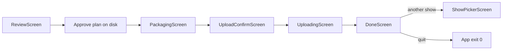

# Deferred: in-TUI package and Archive.org upload

**Status:** implemented in-tree (package pipeline + IA upload module + post-approve TUI screens). Keep this file as the design note; prefer README + [`docs/upload-checklist.md`](../upload-checklist.md) for operators.

**Cursor plan file (may also exist locally):** `.cursor/plans/tui_package_and_upload_bd3d7d2b.plan.md` (or under `~/.cursor/plans/`).

## Overview

After Accept-all / Save & approve, keep the review session open and run packaging then a confirmed Archive.org upload inside Textual—reusing existing export/package APIs and adding a new IA upload module plus in-TUI screens.

## Current gap

Today Accept-all / Save & approve only call `approve_plan` ([`src/dat_tracker/review_plan.py`](../src/dat_tracker/review_plan.py)), write the plan, and `self.app.exit(0)` ([`ReviewScreen`](../src/dat_tracker/tui_review/app.py)). That ends [`ReviewSessionApp`](../src/dat_tracker/tui_review/session.py) with no packaging.

Already implemented offline (not wired into the TUI):

- Export: [`export_tracks_from_plan`](../src/dat_tracker/export_tracks.py) → `{show_id}_tNN.flac`
- Package: [`package_show_from_plan`](../src/dat_tracker/package.py) → `{show_id}.txt` + `fingerprint.ffp.txt` (gated on `review.status=approved`)
- CLI orchestration: [`scripts/package_tracking_plan.py`](../scripts/package_tracking_plan.py), [`track_show.run_track_show`](../src/dat_tracker/track_show.py) (writes under `data/work/<id>/package/`)

Missing: Vorbis tags, `data/out/` promotion, any `ia upload` wrapper, upload checklist docs, TUI continuation after approve.

PLAN.md Phase 3 expects: etree-style identifier, `etree` or `taperssection`, honest credits, `ia` upload—without re-uploading calibration items.

## Locked product decisions

- **Both** Accept-all and Save & approve continue into the same post-approve flow (approve first, then package/upload UI). Quit still exits without packaging.
- Stay in **one Textual process** (same pattern as picker → prepare → review).
- **Never silent-upload**: package with progress, then an Upload confirm screen; operator must confirm.
- Package destination: **`data/out/<show_id>/`** (matches PLAN). Also refresh `data/work/<show_id>/package/` as a working mirror so existing CLI paths stay useful.
- Default IA collection: **`taperssection`**, editable on the confirm screen; subjects include `plan.package.collection_subjects` (e.g. Dave Ward / Brian H).
- Identifier: plan `show_id` (etree style). Preflight refuses upload if catalog marks the show `already_uploaded` or an IA item with that identifier already exists (when `ia` can query).
- Credits from approved `plan.package` (transferer / tracker / source / venue / etc.).

## Implementation

### 1. Library: finish packaging + add upload

Add [`src/dat_tracker/package_pipeline.py`](../src/dat_tracker/package_pipeline.py) (or extend `package.py`):

- `build_package(plan, source_audio, *, project_root) -> PackageResult`
  - `assert_review_approved_for_package`
  - `export_tracks_from_plan` → out dirs
  - write Vorbis tags via **mutagen** (ARTIST, TITLE, ALBUM/DATE/VENUE-ish fields from package + track index/title)
  - `package_show_from_plan` for txt + ffp
  - return paths, track count, out_dir

Add [`src/dat_tracker/ia_upload.py`](../src/dat_tracker/ia_upload.py):

- `build_ia_metadata(plan, *, collection, identifier) -> dict` (title, creator, date, venue/coverage, source, lineage/transfer, subject list, mediatype=audio, collection)
- `ia_configured() -> bool` (check `internetarchive` config / `~/.config/ia.ini`)
- `identifier_exists(identifier) -> bool`
- `upload_package(package_dir, *, metadata, identifier) -> UploadResult` wrapping `internetarchive.get_session().upload(...)` (or equivalent), with progress callbacks
- Unit tests with mocked IA session (no network)

Keep Live Bluegrass-specific subjects/credits in plan/config data, not hardcoded upload logic (PLAN Phase 5).

### 2. TUI screens (session continuation)

Change [`ReviewScreen.action_accept_all` / `action_save_approve`](../src/dat_tracker/tui_review/app.py):

- Approve + write plan as today
- **Do not** `app.exit(0)`
- `dismiss(("approved", plan))` (or push next screen via app callback)

Wire [`ReviewSessionApp`](../src/dat_tracker/tui_review/session.py) with a review dismiss callback:

1. **`PackagingScreen`** — progress log (“Exporting t01…”, “Writing tags…”, “show.txt / ffp…”); worker thread; on failure show error + Retry / Back to review / Quit
2. **`UploadConfirmScreen`** — show package path, file list summary, identifier, collection (editable Input), key metadata, warnings (not configured / already on IA); buttons: **Upload**, **Skip upload** (done with local package only), **Quit**
3. **`UploadingScreen`** — progress / log lines from upload callback
4. **`DoneScreen`** — local path + IA item URL if uploaded; **Review another** (picker) / **Quit**

Direct `dat-review <show-id>` ([`run_review_app`](../src/dat_tracker/tui_review/app.py) / [`run_interactive_review`](../src/dat_tracker/review_cli.py)) uses the same post-approve screen chain (thin App pushes ReviewScreen with the same callback path).

### 3. CLI parity (optional thin wrapper)

Add `scripts/upload_package.py` or extend `package_tracking_plan.py` with `--upload` for headless use; TUI remains the happy path.

### 4. Docs / changelog

- Short [`docs/upload-checklist.md`](upload-checklist.md): `ia configure`, review → package → confirm → upload, collection/credits, don’t re-upload calibration
- README Status / Keys: document post-approve flow
- CHANGELOG Unreleased entries (imperative)
- Suggest semver bump when releasing (e.g. 0.2.0 if packaging/upload is user-facing)

### 5. Tests (TDD)

- Metadata builder tests (subjects, credits, identifier)
- `build_package` with tiny synthetic FLAC fixture (or mock ffmpeg export) + tag assertions
- Upload module mocked session
- Session/pilot test: approve → packaging screen appears (mock `build_package`) → confirm → mock upload → done

## Implementation todos

- [ ] Add `build_package` (export + mutagen tags + txt/ffp) writing `data/out/<show_id>/` and work mirror
- [ ] Add `ia_upload.py`: metadata builder, config check, existence preflight, upload with mocks/tests
- [ ] Stop exiting on approve; Packaging → UploadConfirm → Uploading → Done screens in session + direct review
- [ ] Add `docs/upload-checklist.md`, README notes, CHANGELOG; suggest version bump

## Out of scope for this pass

- Waiting on held-out F1 shipping gates before allowing TUI upload (operator review is the gate for this path)
- Batch multi-show upload
- Web LMA uploader
- Auto-posting Reddit/email
