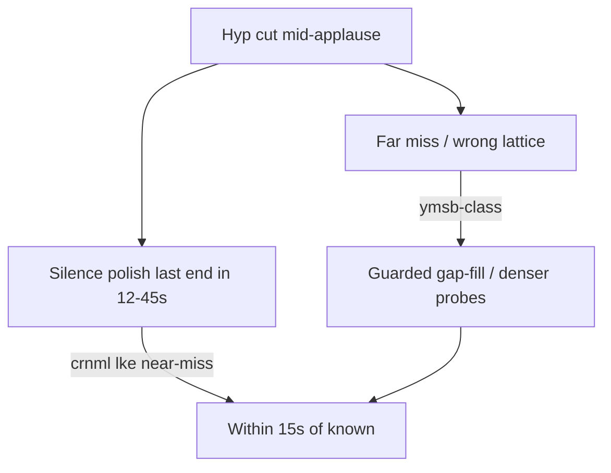

# Plan: reach shipping gates

## Target (locked in [PLAN.md](PLAN.md))

- **Tier B holdout:** mean F1 ≥ **0.85** @ ±15s; no show &lt; **0.70**
- **Tier A:** mean F1 ≥ **0.80** on ≥3 real raw↔Jon shows
- Track \|Δ\| ≤ 1 on ≥ **80%** of those held-out shows
- Stay on calibration; do **not** batch zip `todo`

## Where we are

| Set | Current | Gap |
|-----|---------|-----|
| Tier B train | ~**0.755** (silence polish on prior Gemini plans); min **0.533** (ymsb) | Need train mean ~0.82+ and min ≥0.70 before trusting a holdout check |
| Tier B holdout | ~**0.58** (stale) | Need ~+0.27 mean; worst shows ~0.31–0.33 |
| Tier A | ~**0.37** | Need ~+0.43; JMP Pro collapse 3/11 tracks |

Claude Code’s read matches our empirical result: near-miss placement is the right lever; **landing forward-scrub + silence-polish together is dangerous**; silence-polish can overshoot; forward-scrub lacks a REJECT escape hatch and already **regressed** train when enabled (+30s twins → mean ~0.61).

## Design choices (committed)

1. **Keep `forward_scrub_offset_sec=0` by default** until train mean ≥0.80 with polish+prompt alone for two corroborating runs. Do not re-enable +30s twins as the next experiment.
2. **Keep silence polish on**, but **harden it** against LKE-style overshoot (Claude’s main risk).
3. **Attribute one mechanism per change** (Claude’s process note): polish guards → far-miss → FP suppression → then optional forward scrub with REJECT hatch.
4. **Eval protocol:** temperature already 0.0; require **2 fresh runs** per show before claiming a win; back up plans immediately after good scores.

---

## Phase 0 — Baseline freeze (half day)

- Treat current working plans (pre-placement Gemini + silence polish, train mean ~0.755) as **Baseline A**.
- Record per-show F1, track Δ, and a short near/far miss count for train (script already used in diagnosis).
- Do not change code until Baseline A is written down in README Status / a short note in CHANGELOG Unreleased.

## Phase 1 — Harden silence polish (TDD) — close near-miss safely

Claude risk: last silence in a dense −35dB/0.3s window overshoots into the next song.

In [`src/dat_tracker/refine_cuts.py`](src/dat_tracker/refine_cuts.py) `polish_early_cuts_to_silence_ends`:

- Prefer the **last silence end that is followed by a sustained energy rise** (or first speech onset within ~8s after that silence), not the absolute last blip in 45s.
- Cap move distance (e.g. max +40s) and refuse polish if the cut is already within ~5s of a silence end **or** a speech onset (already-at-start).
- Add regression tests from **crnml near-miss shapes** (must still move) and **LKE already-correct shapes** (must not move). Offline-apply to Baseline A plans; require LKE F1 not below Baseline A.

Wire remains in [`src/dat_tracker/track_show.py`](src/dat_tracker/track_show.py) after listen-center snap (current order is fine).

**Exit:** train mean ≥ **0.78**, LKE not regressed vs Baseline A, polish ablation documented.

## Phase 2 — Far-miss / min-F1 (ymsb-class)

Train min is **ymsb2007 ~0.533**; snap45 oracle only lifts it to ~0.67 — placement polish cannot pass min≥0.70 alone.

In [`src/dat_tracker/refine_cuts.py`](src/dat_tracker/refine_cuts.py) / [`track_show.py`](src/dat_tracker/track_show.py):

- Keep `--gap-fill` off by default; add a **train-script path** that can pass `--gap-fill --gap-fill-max-seg-sec 320` for under-segmented shows only (`should_escalate` / max-seg heuristic already exists).
- Use existing sparse multi-probe (`sparse_candidate_limit`) + ±45s gap-fill clips; corroborate ymsb with **3–5 runs** at temp 0.0 (prior HANDOFF unfinished work).
- If first-listen systematically REJECTS the true candidate cluster, add **one mid-gap probe densification** only when Flash track count &lt; expected_min (duration-based), not globally.

**Exit:** train **min F1 ≥ 0.70** and mean ≥ **0.80** on ≥2 full train batch corroborations.

## Phase 3 — Kill over-segmentation (precision)

Holdout/train both grow extra tracks (Δ=+1…+4). That will cap F1 even when placement is good.

- Tighten first-listen prompt REJECT path for false energy bumps; add Claude’s missing rule: **if neither candidate nor any later evidence shows a real transition, REJECT — do not invent a SNAP**.
- Prefer merging near-duplicate mid cuts (existing `merge_near_duplicate_cuts`) over keeping both song-end and banter-start when &lt; adaptive sep.
- Do **not** re-enable forward scrub until this phase’s train track \|Δ\|≤1 stays ≥80% across 2 batches.

**Exit:** train track \|Δ\|≤1 ≥ **80%** (preferably 100%) with mean still ≥0.80.

## Phase 4 — Train-only few-shot (policy transfer)

Static text few-shot is already in [`listen_clips.py`](src/dat_tracker/listen_clips.py). Next:

- Attach **2–3 short labeled transition clips** drawn only from **Tier B train** known cuts (never holdout/Tier A), into the first-listen prompt as true audio few-shot.
- Keep total clip budget bounded (reuse existing extract helpers).

**Exit:** second corroborating train batch ≥ Phase 2/3 bars; no holdout examples in prompts.

## Phase 5 — Holdout check (once)

Only after Phases 1–4 exit criteria:

- Fresh `run_tier_b_split.py --split holdout --refine` (gap-fill only via escalate heuristic, not blanket).
- Score against gates. If mean ≥0.80 but &lt;0.85, one more train-side iteration on **failure modes shared with train** (not holdout-specific knobs). If min &lt;0.70 on a holdout show, treat as Phase 2 generalization failure.

**Exit:** Tier B holdout mean ≥ **0.85**, min ≥ **0.70**, track Δ gate.

## Phase 6 — Tier A

Harder than synthetic Tier B; do not start until Phase 5 passes or is clearly within ~0.05.

- Guard Pro escalate: gap-fill/refine may **add** cuts; must not drop a well-spaced Flash mid-cut lattice (JMP 3/11).
- Re-run Watson / JMP / YMSB SBD with refine + hardened polish; skip festival Del/OCMS until alignment is fixed.
- Widen refine already exists for ≥4000s; keep it.

**Exit:** Tier A mean ≥ **0.80** on ≥3 shows; track Δ gate.

## Phase 7 — Declare shippable / version

- Update README Status + CHANGELOG; bump past 0.1.0 only when gates pass.
- Only then consider Live Bluegrass `todo` batching.

---

## What we will not do in this campaign

- Re-enable default forward-scrub twins before Phase 3 exit
- Blind snap-to-nearest energy/speech
- Tune thresholds on holdout show IDs
- Full-show Gemini uploads as happy path
- Trust a single noisy run

## Key files

- [`src/dat_tracker/refine_cuts.py`](src/dat_tracker/refine_cuts.py) — polish hardening, gap-fill probes
- [`src/dat_tracker/listen_clips.py`](src/dat_tracker/listen_clips.py) — REJECT hatch, few-shot
- [`src/dat_tracker/track_show.py`](src/dat_tracker/track_show.py) — orchestration order
- [`src/dat_tracker/gemini_tracker.py`](src/dat_tracker/gemini_tracker.py) — Pro merge guards
- [`scripts/run_tier_b_split.py`](scripts/run_tier_b_split.py) / score scripts — eval

## Success definition

“Passing” means **held-out** gates in PLAN.md are green on a fresh run, not train-only polish. Intermediate train bars above are gates *to the next phase*, not shipping.