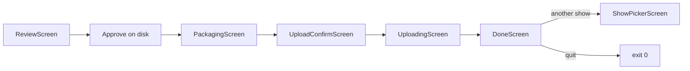

# In-TUI package and Archive.org upload

Resume [`docs/plans/in-tui-package-and-archive-upload.md`](docs/plans/in-tui-package-and-archive-upload.md). Locked decisions there still apply. **Do not bump version** — remain `0.1.0` in [`pyproject.toml`](pyproject.toml); document under CHANGELOG Unreleased only.

## Current state

- Approve in [`ReviewScreen`](src/dat_tracker/tui_review/app.py) writes the plan and **`app.exit(0)`** — no package/upload.
- Offline packaging already exists: [`export_tracks_from_plan`](src/dat_tracker/export_tracks.py), [`package_show_from_plan`](src/dat_tracker/package.py) / [`format_show_txt`](src/dat_tracker/show_txt.py), CLI [`scripts/package_tracking_plan.py`](scripts/package_tracking_plan.py).
- Missing: mutagen Vorbis tags, `data/out/<show_id>/`, `ia_upload`, post-approve TUI screens.

## Phase A — Library (TDD first)

### 1. `build_package` in new [`src/dat_tracker/package_pipeline.py`](src/dat_tracker/package_pipeline.py)

- `assert_review_approved_for_package`
- Export tracks into **`data/out/<show_id>/`** and mirror under **`data/work/<show_id>/package/`**
- Write Vorbis tags with **mutagen** (ARTIST, TITLE, ALBUM/DATE/TRACKNUMBER from `plan.package` + track; keep Live Bluegrass specifics out of hardcoded upload logic)
- Call existing `package_show_from_plan` for `{show_id}.txt` + `fingerprint.ffp.txt`
- Return a small `PackageResult` (out_dir, track paths, counts)

Tests: tiny synthetic FLAC fixture or mocked `export_tracks_from_plan`; assert tags + txt/ffp paths. Extend [`tests/test_package.py`](tests/test_package.py) or add `tests/test_package_pipeline.py`.

### 2. [`src/dat_tracker/ia_upload.py`](src/dat_tracker/ia_upload.py)

- `build_ia_metadata(plan, *, collection, identifier)` — title, creator, date, venue/coverage, source, lineage/transfer, subjects from `plan.package.collection_subjects`, `mediatype=audio`, collection
- Default collection **`taperssection`** (editable later in TUI)
- `ia_configured()`, `identifier_exists()`, catalog `already_uploaded` preflight via existing catalog helpers where present
- `upload_package(..., progress_cb=...)` wrapping `internetarchive` session upload
- Unit tests with **mocked** session (no network)

## Phase B — TUI continuation

### 3. Stop exiting on approve

In [`ReviewScreen.action_accept_all` / `action_save_approve`](src/dat_tracker/tui_review/app.py): approve + write as today, then **dismiss / hand off** instead of `exit(0)`. Quit still exits without packaging.

### 4. Screens in [`ReviewSessionApp`](src/dat_tracker/tui_review/session.py) (and direct `dat-review <show-id>` path)

1. **PackagingScreen** — worker thread + progress log; Retry / Back to review / Quit on failure
2. **UploadConfirmScreen** — path summary, identifier=`show_id`, editable collection, metadata preview, warnings (`ia` not configured / already on IA); **Upload** / **Skip upload** / **Quit**
3. **UploadingScreen** — progress from callback
4. **DoneScreen** — local path + IA URL if uploaded; **Review another** (picker) / **Quit**

Never silent-upload: confirm is mandatory.

## Phase C — Docs / CLI thin parity

- [`docs/upload-checklist.md`](docs/upload-checklist.md): `ia configure`, review → package → confirm → upload, credits, don’t re-upload calibration
- README: post-approve keys/flow; keep Gemini key docs as-is
- Optional: extend [`scripts/package_tracking_plan.py`](scripts/package_tracking_plan.py) with `--upload` for headless (TUI remains happy path)
- CHANGELOG Unreleased only; **no** `pyproject.toml` version change
- Mark deferred plan status as in-progress / done when shipped; leave PLAN.md Phase 3 pointer accurate

## Out of scope (this pass)

- Multi-set `_sNtNN` filenames, batch upload, web LMA uploader, Reddit posting, waiting on held-out F1 gates before allowing TUI upload (operator review remains the gate)
- Semver bump to 0.2.0 (deferred until Reddit-ready)
