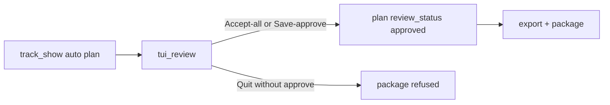

# Plan: required TUI review editor (with Accept-all fast path)

## Feasibility (locked answers)

Yes — within reach as a **cut / label / metadata editor with waveform + playback**, not a full DAW.

| Capability | Approach | Cross-platform |
|---|---|---|
| Waveform | Precompute peak envelope (numpy + soundfile/ffmpeg decode); draw with braille/half-blocks in Textual | Linux / Windows / macOS terminals |
| Drag / nudge cuts | Keyboard primary (←/→, `[`/`]`, zoom); mouse drag on markers where Textual supports it | Same |
| Playback | `sounddevice` (PortAudio): play/pause, jump to cut, loop ±N s around selected boundary | Same; document PortAudio install |
| Spectrograms | **Out of v1** (terminal-graphics only; breaks plain Windows/SSH) | Optional later |

Amend [PLAN.md](PLAN.md) locked line: automation still produces the plan; **packaging/upload requires an explicit human accept** (one-key Accept-all or full edit session). This replaces “do not build a required waveform review UI” with “required review gate with Accept-all fast path; not a DAW.”

## Workflow



- Happy path when auto looks good: open TUI → **Accept all** → package.
- Hard shows: scrub waveform, nudge cuts, edit titles/types/segues/show fields → **Save & approve** → package.
- `scripts/package_tracking_plan.py` / `track_show` package step **refuse** unless `review_status == "approved"` (or CLI `--force-unreviewed` for recovery only).

## Stack

- **UI:** [Textual](https://textual.textualize.io/) (widgets, layouts, mouse, CSS, Windows-friendly)
- **Waveform data:** `numpy` + decode via existing **ffmpeg** to temp PCM or `soundfile` if FLAC works; cache envelope under `data/work/<show_id>/waveform_envelope.npz`
- **Playback:** `sounddevice`
- **Optional extra:** `mutagen` for Vorbis tag write when packaging (aligns with PLAN Phase 2 item 5)
- New optional dep group: `[project.optional-dependencies] review = ["textual", "numpy", "soundfile", "sounddevice", "mutagen"]` so core Gemini tracking stays lean; document `pip install -e '.[review]'`

## Data model

Extend [catalog/tracking_plan.schema.json](catalog/tracking_plan.schema.json) (bump `schema_version` to `1.1.0`):

- Keep existing `cuts_sec`, `tracks[]` (`title`, `track_type`, `segue_into_next`, …)
- Add show-level `package` object (today these are CLI-only in [package.py](src/dat_tracker/package.py)): `artist`, `date`, `venue`, `city`, `state`, `source`, `transfer`, `transferer`, `tracker`, `collection_subjects[]`, `set_label`, notes for show.txt
- Add `review`: `{ "status": "pending"|"approved"|"rejected", "approved_at", "approved_by", "method": "accept_all"|"edited" }`
- On cut edits, call existing [`rebuild_tracks_from_cuts`](src/dat_tracker/refine_cuts.py) so track start/end stay consistent; preserve titles/types by index/nearest cut when possible

Migration: loaders accept `1.0.0` plans, fill default `package` from CLI/catalog, set `review.status=pending`.

## TUI layout (single composition)

```text
┌ Show / package metadata (artist date venue …) ────────── Accept-all │ Save&approve │ Quit ┐
├ Track list (index, type, title, segue, duration) ─ editable ─────────────────────────────┤
├ Waveform overview (full show) with cut markers ──────────────────────────────────────────┤
├ Detail waveform (zoom around selected cut) + playhead ───────────────────────────────────┤
└ Status: time │ selected cut │ play state │ dirty? ───────────────────────────────────────┘
```

### Interactions (v1)

- Select cut / track in list or by clicking marker
- Nudge cut ±0.05 / ±0.5 / ±5 s; type exact time
- Insert / delete mid cut (endpoints 0 and duration locked)
- Edit title, `track_type`, `segue_into_next` inline
- Edit package metadata fields
- Playback: Space play/pause; `l` loop ±8s around cut; `j`/`k` seek; stop on quit
- **Accept all:** mark approved with `method=accept_all`, write plan, exit 0 (no forced scrub)
- **Save & approve:** write plan with edits, `method=edited`, exit 0
- Quit without approve: write optional draft if dirty (prompt), leave `pending`, non-zero or distinct exit so scripts stop

## Code layout

| Piece | Path |
|---|---|
| Envelope cache | `src/dat_tracker/waveform.py` |
| Playback helper | `src/dat_tracker/audio_playback.py` |
| Plan mutate / review flag | `src/dat_tracker/review_plan.py` |
| Textual app | `src/dat_tracker/tui_review/` (`app.py`, `widgets/waveform.py`, `widgets/track_table.py`, `widgets/package_form.py`) |
| CLI | `scripts/review_show.py` + console script `dat-review` |
| Gate in pipeline | [track_show.py](src/dat_tracker/track_show.py), [scripts/package_tracking_plan.py](scripts/package_tracking_plan.py) |
| Docs | README Status + install (`.[review]`), PLAN.md amend |

Reuse: `validate_tracking_plan`, `rebuild_tracks_from_cuts`, `export_tracks_from_plan`, `package_show_from_plan`.

## Pipeline gate

1. `run_track_show(..., skip_package=False)` after writing plan: if `review.status != approved`, either spawn `review_show` when TTY + review deps present, or exit with clear message to run `dat-review`.
2. Packaging functions check `review.status == "approved"` unless `--force-unreviewed`.
3. Catalog / show.txt “Tracked by” can note human-accepted vs accept-all if useful later; v1 just stores `review.method` in the plan.

## Testing (TDD)

- Envelope: length/monotonic peaks for a tiny synthetic wav fixture
- `rebuild` after nudge/insert/delete preserves endpoints and track count invariants
- Review gate: package raises/refuses when `pending`; succeeds when `approved`
- Accept-all writes `method=accept_all` without changing cuts
- Waveform widget: render string width / marker column mapping (pure unit, no TTY)
- Optional: Textual pilot app test for key bindings if stable enough; otherwise keep logic out of widgets

Manual checklist (Linux + one of Win/mac): open real calibration show, Accept-all; second run nudge + loop playback + Save & approve + export.

## Implementation phases

1. **Schema + review_plan + gate** — `1.1.0`, approve/pending, package refuse; Accept-all CLI without TUI (`dat-review --accept-all`) so automation scripts and tests work headless.
2. **Waveform + playback libraries** — envelope cache, play/loop helpers, unit tests.
3. **Textual app MVP** — track list + package form + Accept-all / Save&approve / Quit; no waveform yet but loads/saves plan.
4. **Waveform widgets** — overview + detail, markers, nudge/insert/delete wired to rebuild.
5. **Playback integration** — transport keys, playhead on detail view.
6. **Wire track_show + docs + PLAN.md** — required gate with spawn-or-instruct; version/changelog; README.

## Explicit non-goals (v1)

- Destructive audio editing (gain, fades, denoise)
- Multi-track mixing / playlist rearrange beyond cut list
- Required spectrogram / Kitty-only graphics
- Replacing Gemini auto-track (TUI starts from its plan)
- Batch GUI; TUI is per-show (batch can `--accept-all` when operator trusts auto)

## Success criteria

- Same commands work on Linux, Windows, macOS after `pip install -e '.[review]'` + PortAudio + ffmpeg
- Operator can Accept-all in one action or fully edit cuts/labels/show metadata
- Package/upload path cannot complete without approval (unless forced escape hatch)
- Calibration shipping gates unchanged; TUI does not replace held-out F1 work
