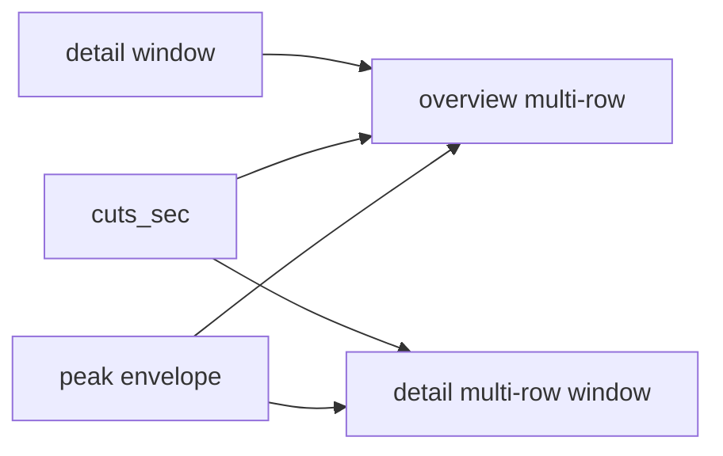

# Improve review TUI waveforms

## Why it looks confusing now

[`render_envelope_line`](src/dat_tracker/waveform.py) draws **one** row of `▁▂▃▄▅▆▇█`. Overview height is only 3 ([`WaveformView`](src/dat_tracker/tui_review/widgets/waveform.py)), and the title eats a line—so the “waveform” is a thin streak. Loud continuous music also normalizes to a near-flat wall of high blocks, so cut context disappears. Detail is the same alphabet over ~40s, so silences/peaks are hard to parse.

## Approach (chosen)

Stay on Textual + Unicode (no plot library). Render a **centered multi-row amplitude silhouette** (half-blocks / full blocks stacked vertically), with Rich styling for markers.

### Core render API — [`src/dat_tracker/waveform.py`](src/dat_tracker/waveform.py)

- Add `render_envelope_panel(peaks, *, width, height, ...)` returning a Rich `Text` (or list of styled lines):
  - Resample peaks to `width`
  - Apply **sqrt amplitude** (or similar gamma) so quiet gaps read as gaps
  - For each column, paint `height` rows as a vertical bar (mirror or bottom-aligned silhouette)
  - Overlay **cut columns** in a distinct style (`|` / full-height bar), **selected cut** brighter, **playhead** as a different glyph/color
  - Keep `render_envelope_line` as a thin wrapper or deprecate in tests only if unused
- Add optional **time ruler** helper: `0:00 … mm:ss` ticks under the panel
- Add overview **viewport band**: columns covering the current detail window get a background highlight so overview answers “where am I?”

### Widgets — [`src/dat_tracker/tui_review/widgets/waveform.py`](src/dat_tracker/tui_review/widgets/waveform.py)

- Raise overview height (~6–8) and detail height (~8–10)
- `render()` uses the multi-row panel + ruler; label stays above (`overview`, `detail: a–b`)
- Detail continues remapping absolute cuts/playhead into the window (existing `set_detail`)
- Overview receives `viewport=(start, end)` from the app when refreshing

### App wiring — [`src/dat_tracker/tui_review/app.py`](src/dat_tracker/tui_review/app.py)

- Pass selected-cut emphasis + detail window into overview on `_refresh_waveforms`
- Slight CSS tweaks so waveforms don’t collapse under the track table

### Tests — TDD in [`tests/test_waveform.py`](tests/test_waveform.py)

- Panel height × width character grid
- Marker column still lands on expected x
- Sqrt scaling: quiet peaks occupy fewer rows than loud
- Viewport highlight spans expected columns (assert via Rich span styles or a testable intermediate grid)

### Docs

- Changelog imperative entry under Changed
- One-line README note that overview shows full-show silhouette + viewport; detail is a zoomed cut window

## Out of scope (this pass)

- Click/drag scrubbing on the waveform
- Stereo / spectrogram views
- Replacing Textual with a GUI DAW

## Why `date` / `venue` / `state` etc. are blank

Three separate causes (all true for `sbb2001-04-27.flac16`):

1. **Gemini never fills `plan.package`.** The written plan has every package field `null`. Titles live in listen *notes* / tracks (now hydrated); venue/lineage were never written into the package block.
2. **Current seed only fills a few fields.** [`seed_package_metadata`](src/dat_tracker/review_hydrate.py) sets `artist` + `date` from [`catalog/calibration_tier_b.json`](catalog/calibration_tier_b.json) (and date from show-id), plus default `tracker`. Catalog rows do **not** store venue/city/state/source/transfer — so those stay blank even after a correct seed.
3. **TUI seed can miss the catalog.** [`ReviewApp`](src/dat_tracker/tui_review/app.py) calls `seed_package_metadata(self.plan)` with no `project_root` (`Path.cwd()`). If the shell isn’t the repo root, artist stays null; date can still come from the show-id regex. A screenshot where **date** is also empty usually means an older run before hydrate was wired, or the scrollable package form is mostly showing fields that were never seeded (venue/state/…).

Ground truth for this show *does* exist on disk as the published info file under calibration, e.g. `data/calibration/sbb2001-04-27.flac16/sam bush&jerry douglass2001-04-27nak.700's.Merlefest.txt` (Merlefest / Wilkesboro / source line). Nothing in review reads that yet.

### Package seed fix (same pass)

- Always pass an explicit `project_root` into `seed_package_metadata` from both [`scripts/review_show.py`](scripts/review_show.py) and the TUI (repo root relative to package/`__file__`, not cwd).
- Extend hydrate to **parse a published show `.txt`** next to the calibration media when present (`data/calibration/<show_id>/*.txt`, prefer the non-ffp info file): artist, venue, city/state, date, source/transfer lines → fill only empty package fields.
- Keep CLI `--artist` / `--venue` / … as overrides (already on `review_show`).
- Tests: fixture txt → seeded package dict; no overwrite when fields already set; missing txt still gets date/artist from catalog/show-id.
- Optional UX polish: collapse or shorten the package block so seeded values aren’t scrolled out of the first viewport (only if cheap alongside waveform height changes).